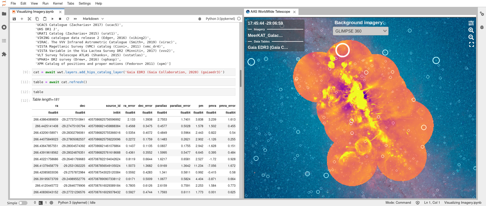
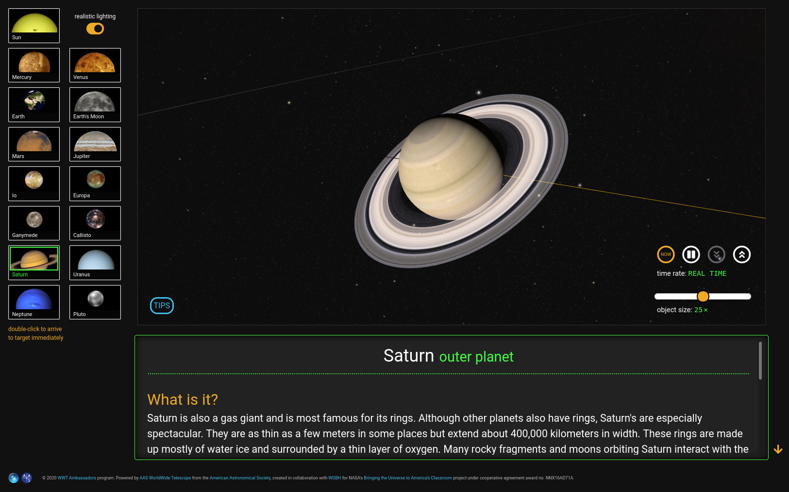

<!-- launch video: -->
<iframe width="736" height="414" src="https://www.youtube.com/embed/U7PIAKCZHYM" title="YouTube video player" frameborder="0" allow="accelerometer; autoplay; clipboard-write; encrypted-media; gyroscope; picture-in-picture" allowfullscreen></iframe>

# WWT 2022

The 2022 edition of AAS WorldWide Telescope launched on February 15th, 2022.

WWT isn’t a physical telescope — it’s a suite of free and open source software
and data sets that combine to create stunning scientific visualizations and
stories. While WWT started out as a standalone Windows application, it’s evolved
into a powerful astronomy visualization toolkit that you can use on the desktop,
in the browser, and from Python. To learn more, visit [the WWT
homepage][wwthome]{:target="_blank"}.

[wwthome]: https://worldwidetelescope.org/home/

An “edition” is a coordinated release of the many software and data components
that comprise the WWT ecosystem. This edition homepage covers:

- [What’s New](#whats-new)
- [See WWT 2022 In Action](#see-wwt-2022-in-action)
- [Get Started with WWT 2022](#get-started-with-wwt-2022)
- [Release Notes](#release-notes)
- [Donate to WWT](#donate-to-wwt)
- [Additional Resources](#additional-resources)

## What’s New

So many things! WWT 2022 wraps up several years’ worth of improvements to all
aspects of WWT. [Watch the official WWT 2022 launch video][yt]{:target="_blank"}
or [read the AAS press release][pr]{:target="_blank"} for an overview. The
highlights include:

[yt]: https://youtu.be/U7PIAKCZHYM
[pr]: https://aas.org/press/WWT-2022

- A new WWT “research app” for seamlessly integrated data analysis
  and visualization in [JupyterLab]
- New support for [HiPS] imagery and catalogs
- A new system for “tiling” [FITS] datasets to allow even gigapixel-scale
  scientific images to be explored interactively ([supported by the NSF][2004840])
- A dramatically expanded suite of data tools for converting all kinds of images
  and datasets into WWT’s formats (partially supported by [Space Telescope
  Science Institute][stsci])
- A new stable release of the WWT Windows application
- Literally thousands of beautiful new astronomy images integrated into WWT’s
  data holdings
- And more!

[JupyterLab]: https://jupyter.org/
[HiPS]: http://aladin.u-strasbg.fr/hips/
[FITS]: https://en.wikipedia.org/wiki/FITS
[2004840]: https://www.nsf.gov/awardsearch/showAward?AWD_ID=2004840
[stsci]: https://www.stsci.edu/

## See WWT 2022 In Action

Here are some great ways to see some of the things that WWT 2022 can do:

- For researchers and other technically-minded folks, you can dive right into
  [our cloud-based tutorial notebooks][mybinder]{:target="_blank"} that
  demonstrate the usage of the new WWT JupyterLab app.
- [Click here][meerkat-gc]{:target="_blank"} to open up a freestanding version
  of the app to showcase an incredible image of the Milky Way galactic center at
  radio wavelengths from the MeerKAT telescope ([details
  here][meerkat-deets]{:target="_blank"})
- The [Solar System Explorer][sse]{:target="_blank"} is a WWT-powered
  educational web application created by the [WWT
  Ambassadors][wwta]{:target="_blank"} group. It didn’t take a team of software
  engineers to create this — just a pair of astronomer/educators with a keen eye
  for design and willingness to learn a bit of JavaScript!
- [This *Sky & Telescope* article][sandt-nye]{:target="_blank"} embeds a WWT
  “guided tour” to provide an interactive, multimedia tour of the some bright
  stars in the northern winter night sky.

[mybinder]: https://bit.ly/pywwt-notebooks
[meerkat-gc]:  https://bit.ly/wwt-meerkatgc_jan22
[meerkat-deets]: https://www.sarao.ac.za/media-releases/new-meerkat-radio-image-reveals-complex-heart-of-the-milky-way/
[sse]: http://projects.wwtambassadors.org/solar-system-explorer/
[wwta]: https://wwtambassadors.org/
[sandt-nye]: https://skyandtelescope.org/astronomy-news/tour-15-of-the-brightest-stars-on-new-years-eve-video/

All of these examples build on the WWT visualization technology that also powers
the core WWT [web client][webclient] and [Windows client][windows] applications.

[webclient]: https://worldwidetelescope.org/webclient/
[windows]: https://worldwidetelescope.org/download/

## Get Started with WWT 2022

There’s no one way to “install WWT” because the software spans so many different
uses. Here are our recommendations for different kinds of users:

- [Researchers](./researchers/): install WWT’s Python modules and
  Jupyter/JupyterLab extensions
- [Enthusiasts](./enthusiasts/): explore the universe with WWT's web and Windows applications
- [Educators](./educators/): explore WWT educational apps and create your own “guided tours”
- [Planetarians](./planetarians/): set up WWT in your planetarium or museum
- [Image creators](./creators/): install WWT’s data processing tools
- [App developers](./developers/): start using the WWT toolkit in Python or JavaScript/TypeScript

## Release Notes

In these notes you'll find synthetic discussions of changes in WWT 2022 compared
to previous versions.

- [Detailed list of WWT 2022 component versions](./components/)
- Release notes for WWT web applications:
  - [Web client](./webclient/)
  - [Embed and Sharing app](./embed/)
  - [Research app](./research-app/)
  - [Embed Creator app](./embed-creator/)
- Release notes for WWT desktop applications:
  - [Windows client](./winclient/)
  - [WWT Aligner](./aligner/)
  - [Excel add-in](./excel-addin/)
  - [Remote Control app](./remote/)
- Release notes for supporting packages:
  - [Data holdings](./data/)
  - [WWT WebGL Engine](./engine/)
  - [pywwt](./pywwt/)
  - [toasty](./toasty/)
  - [Vue/Vuex engine interface](./engine-vuex/)
  - [WWT JupyterLab extension](./jupyterlab/)

To learn about changes to a component of WWT 2022 not listed above, consult its
technical changelog as linked from the [detailed versions list](./components/).

## Donate to WWT

As part of the non-profit [American Astronomical Society][aas], WWT's mission is
to help scientists and educators showcase astronomical data and knowledge. WWT's
web servers send out gigabytes of data every hour to hundreds of thousands of
visitors every year. Your contributions help keep the WWT servers running,
delivering beautiful astronomical imagery to users around the world for free,
and demonstrate the breadth of the community that values WWT. Please consider
donating to WWT and spreading the word!

[aas]: https://aas.org/

> ### [Click here to donate to WWT now!](https://my.aas.org/services/AAS_Member/Fundraising/WWT/Donate_Now.aspx)

## Additional Resources

- To stay informed about everything WWT, [sign up for the WWT
  newsletter](https://bit.ly/wwt-signup)!
- [The WWT Documentation Hub][dochub], home to virtually all primary WWT documentation
- People using WWT for research should seek help in the `#wwt` channel of the
  [Astropy Slack workspace](https://astropy.slack.com/). If you're not already a
  member, you can [get an Astropy Slack account](http://joinslack.astropy.org/)
  in one simple step.
- For other kinds of questions, try the more generalist [WWT
  Forum](https://wwt-forum.org/).

[dochub]: https://docs.worldwidetelescope.org/
