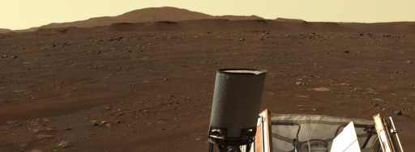
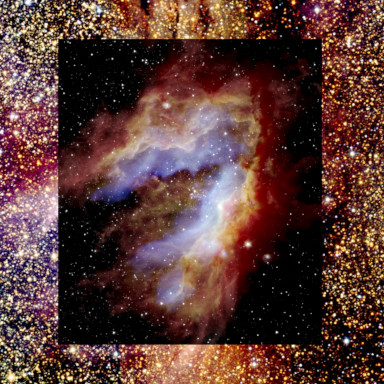

# WWT Newsletter: June 2021

Hello WWT community!

It's been a little while since we've sent out an update but we've certainly been
keeping busy! Here's a brief rundown of just a portion of what's new in the WWT
world.

Best,
Peter K. G. Williams, Director of the AAS WorldWide Telescope Project

---

## Mars, Mars, Mars!

The Perseverance Rover landed on Mars in Jezero Crater on Feb 18! Visit our
YouTube channel to compare [Jezero Crater and Gale
Crater](https://youtu.be/mI6yClu1gB0) (home to the Curiosity Rover). Explore
Mars in the extremely detailed [THEMIS IR Day 100
m/pixel](https://bit.ly/wwt-themisweb) imagery and put yourself on the surface
of Mars with some [panoramas](http://bit.ly/wwt-marspanos_may21) from both
Jezero (Perseverance) and Gale (Curiosity).

## Astronomy Interactives for Online Learning

The WWT Ambassadors Program, led by Dr. Patricia Udomprasert at Harvard,
recently created three new web-based educational
[activities](https://wwtambassadors.org/astronomy-interactives) for middle and
high school students in collaboration with GBH, NASA's Universe of Learning, and
funding from NASA — all powered by WWT technology. Check out the [Solar System
Explorer](http://projects.wwtambassadors.org/solar-system-explorer/), the [Life
Cycle of Stars](http://projects.wwtambassadors.org/star-life-cycle/), and
[Hubble's Evidence for the Big
Bang](http://projects.wwtambassadors.org/galaxy-history-universe/).

## June 4 and 7: WWT at the American Astronomical Society Meeting 238

We invite registered [AAS238](https://aas.org/meetings/aas238) participants to
join two WWT-related events. On June 4 — that's tomorrow! — there will be an
introductory WWT workshop. Preregistration is required. On Monday June 7, join a
broader group to discuss the future of astronomy data visualization in the AAS
238 splinter session: [Astronomical Data Visualization in the Age of Science
Platforms](https://bit.ly/astrodataviz2021). This event does not require any
registration beyond basic AAS238 attendance.

## New SOFIA Collection

Peruse a new batch of beautiful [imagery](https://bit.ly/wwt-sofia_mar21) from
NASA's SOFIA — the Stratospheric Observatory for Infrared Astronomy — in WWT.
Compare SOFIA's data against some of the newly supported HiPS IR datasets such
as NEOWISE (found in the folder Explore → Collections → HiPS → Images → IR).

## Embed WWT in Your Own Webpages

We teased it before and WWT's new web embedding functionality has been
perofrming well!. Check out WWT embeds used for [Sky &
Telescope](https://skyandtelescope.org/) articles, such as an interactive video
highlighting the 15 brightest stars on [New Years
Eve](https://skyandtelescope.org/astronomy-news/tour-15-of-the-brightest-stars-on-new-years-eve-video/)
or simply interactive image viewing of the [Crab
Nebula](https://skyandtelescope.org/astronomy-news/mystery-bursts-coming-from-the-crab-pulsar-are-even-more-powerful-than-we-knew/).
Or [create your own WWT embeds](https://embed.worldwidetelescope.org/) — our
tool will generate HTML `<iframe>` code that you can plug right into a website.

## Stay in Touch!

We always love to hear from WWT users and enthusiasts. [Follow our social media
accounts](https://worldwidetelescope.org/connect/), email <wwt@aas.org>, or post
on [the WWT forum](https://wwt-forum.org/).