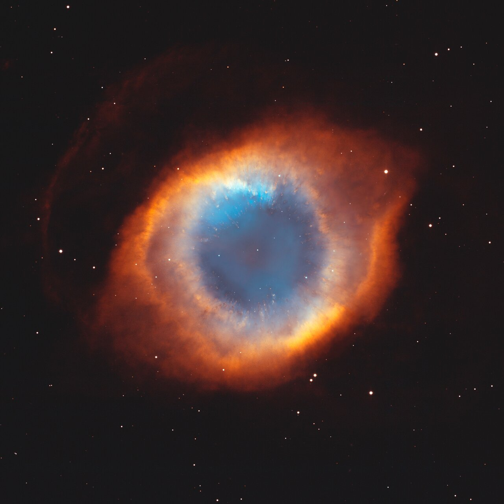
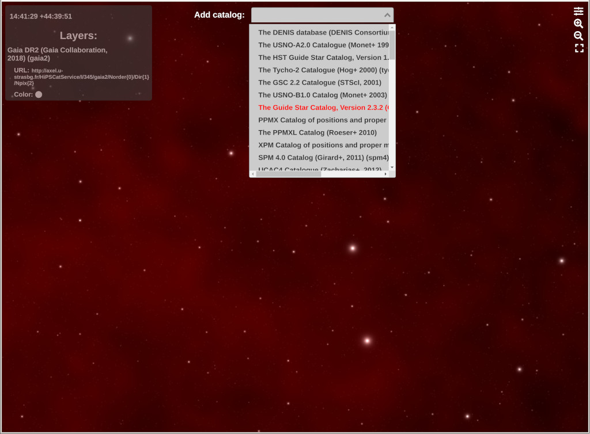
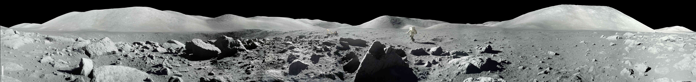

# WWT Newsletter: July 2021

Hello WWT community! 

We're continuing our effort to shine a light on what's going on in the world of
[AAS WorldWide Telescope](https://worldwidetelescope.org/home/) — we hope you
enjoy this month's updates! If you've got any of your own news to share, let the
team know on social media or by emailing <wwt@aas.org>.

This update contains:

- [Hundreds of fresh images in new NOIRLab collection](#hundreds-of-fresh-images-in-new-noirlab-collection)
- [WWT in Jupyter Notebooks: Sneak preview of new all-sky catalogues!](#wwt-in-jupyter-notebooks-sneak-preview-of-new-all-sky-catalogues)
- [WWT Events: AAS238 (recap) and SEPA (July 30/31)](#wwt-events-aas238-recap-and-sepa-july-3031)
- [Embed WWT Panoramas Online](#embed-wwt-panoramas-online)

Best,
Peter K. G. Williams, Director of the AAS WorldWide Telescope Project

---

## Hundreds of fresh images in new NOIRLab collection

Peruse a multitude (over 325!) of new-to-WWT
[images](https://bit.ly/wwt-noirlab_jul21) from the NSF's NOIRLab (formerly
NOAO). Our favorites include the Andromeda Galaxy, the Helix Nebula (screenshot
below), and the DECam image of the Center of the Milky Way — how about you? Let
us know!

Importing this imagery into WWT has been a major effort over the last few
months, calling upon the careful alignment skills of visualization expert David
Weigel. Watch our original [NOIRLab Hype Video](https://youtu.be/xFWaAvMFoyI)
and see where the imagery curation process all started.

## WWT in Jupyter Notebooks: Sneak preview of new all-sky catalogues! 

WWT's brainiac developers have been [hard at
work](https://github.com/WorldWideTelescope/wwt-webgl-engine/pull/119) adding
new features for astronomy researchers. They've recently added a "Minimum Viable
Product" of support for [HiPS progressive
catalogs](http://aladin.u-strasbg.fr/hips/), allowing you to see the positions
of billions of surveyed stars as you explore the sky in WWT. Here's a screenshot
showing stars from the [Gaia DR2](https://www.cosmos.esa.int/web/gaia/dr2)
catalog overlaid on the famous [Schlegel/Finkbeiner/Davis dust
map](https://dustmaps.readthedocs.io/en/latest/maps.html#sfd):

Upcoming work will make all of these stars clickable so that you can to pull the
catalog information into Python with [pywwt](https://pywwt.readthedocs.io/) —
stay tuned!

## WWT Events: AAS238 (recap) and SEPA (July 30/31)

WWT had a successful AAS238, with a workshop on Friday and sponsorship of a
splinter session on "Astronomical Data in the Age of Science Platforms". The
splinter session had a high-water mark of 60 attendees and generated good
discussion and enthusiasm. Presentations will be posted soon on [the event
website](https://worldwidetelescope.github.io/events/2021/aas238-webdataviz.html)
where people can also sign up to be notified of future activities including the
preparation of a "needs assessment" report based on the day's discussion. 

**Upcoming on July 30/31**: is the [Southeastern Planetarium Association
Conference](http://www.sepadomes.org/portfolio/sepa-2021-virtual-meeting/) WWT
workshop: "Creating Web Interactives Using AAS WorldWide Telescope". Attendees
will explore how to create custom web interactives allowing individuals to
continue their planetarium experience virtually using WWT. Join U.S. Space &
Rocket Center INTUITIVE Planetarium Director, David Weigel, for a brief WWT web
interactives tutorial and examine various use cases. From zoomable imagery to
interactive tours, there are limitless possibilities for your creativity.

## Embed WWT Panoramas Online

Brand new to WWT's embed tool is the ability to explore panoramic imagery. Check
out a fullscreen panorama of the [Apollo 17 Station
5](https://bit.ly/wwt-a17_s5) (so many boulders!) that was created using the
[embed tool](https://embed.worldwidetelescope.org/). It's easy to create your
own — our tool will generate HTML `<iframe>` code that you can plug right into a
website.

## Stay in Touch!

We always love to hear from WWT users and enthusiasts. [Follow our social media
accounts](https://worldwidetelescope.org/connect/), email <wwt@aas.org>, or post
on [the WWT forum](https://wwt-forum.org/).