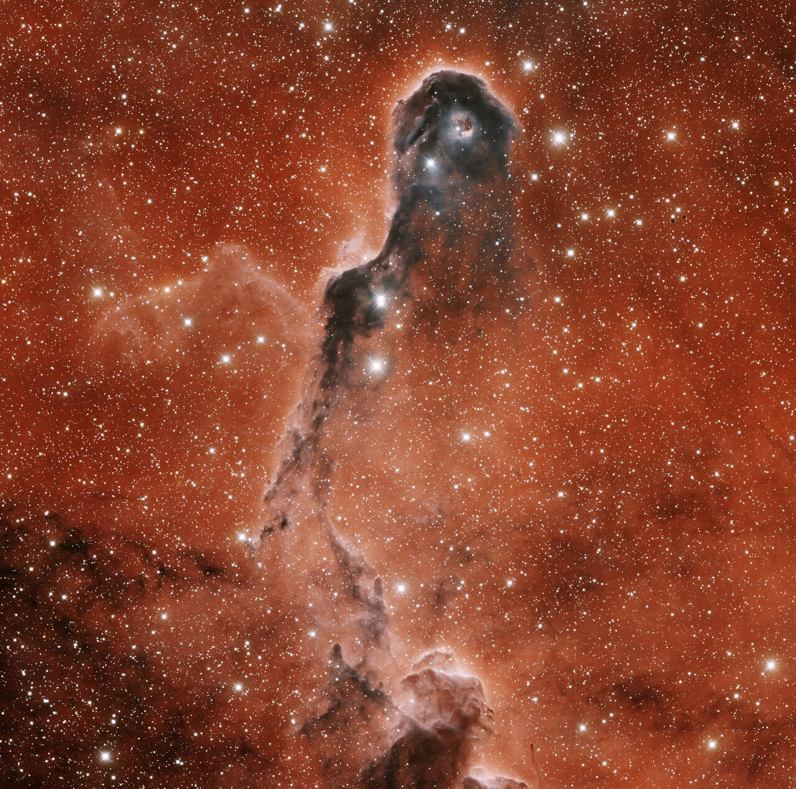

# WWT Newsletter: August 2021

Hello WWT community!

We hope the end of summer is treating you well. Here is what's going on in the
world of [AAS WorldWide Telescope](https://worldwidetelescope.org/home/)! As
usual, if you've got any of your own news to share, let the team know on social
media or by emailing <wwt@aas.org>.

In this update:

- [HiPS Catalogues in JupyterLab](#hips-catalogues-in-jupyterlab)
- [WWT Events: SEPA Recap](#wwt-events-sepa-recap--creating-web-interactives-using-aas-worldwide-telescope-july-30)
- [More new NOIRLab Images in WWT](#more-new-images-for-the-noirlab-collection)
- [New Features in Toasty Pipeline Software](#toasty-pipeline-software--new-features)

Best,
Peter K. G. Williams, Director of the AAS WorldWide Telescope Project

---

## HiPS Catalogues in JupyterLab

The WWT development team continues to progress the functionality of HiPS
Catalogues in JupyterLab — the latest [sneak peak](https://youtu.be/rObWcR5L4EU)
is on YouTube! You can now navigate huge (billion-row) catalogs on the sky, then
pull the data into Python using the [pywwt](https://pywwt.readthedocs.io/)
library. There's a bit more work to be done to polish up the functionality (like
writing documentation 😅), but we hope you'll agree that the video is super
cool!

## WWT Events: SEPA Recap — Creating Web Interactives Using AAS WorldWIde Telescope (July 30)

The WWT workshop at the the [Southeastern Planetarium Association
Conference](http://www.sepadomes.org/portfolio/sepa-2021-virtual-meeting/) was a
resounding hit with the ~50 participants. David Weigel, of the U.S. Space &
Rocket Center INTUITIVE Planetarium, demonstrated how to create custom web
interactives allowing individuals to continue their planetarium experience
virtually using WWT. Since the workshop took place on July 30th (the 50th
anniversary of the Apollo 15 landing), one of the sample interactives was a tour
of the [Apollo 15 Stop 9A](https://bit.ly/wwt-a15_s9a) during the third day's
EVA. Press the spacebar while the tour is playing to pause playback and explore
on your own.

## More new images for the NOIRLab collection

Recent efforts from NOIRLab to add WCS metadata to older images has provided us
the opportunity to process many more [images](https://bit.ly/wwt-noirlab_aug21)
to add to the NOIRLab collection, which brings our total to over 375! Our
favorite of the current new batch is the Elephant Trunk Nebula (IC 1396A).

Stay tuned for more images from NOIRLab to be added to WWT as we have ~150 still
in the pipeline ready for alignment. And speaking of pipelines ...

## Toasty Pipeline Software — New Features

[Toasty](https://toasty.readthedocs.io/) is a software tool that allows users to
process astro imagery into the "tile pyramids" that enable quick and easy
viewing in WWT. You can use it to process single images, and it also has a
"pipeline" mode for handling image collections like NOIRLab's. WWT's development
team has released a new version of toasty, the 0.7 series, with some useful
improvements in the pipeline functions. Images can now be permanently ignored —
useful when the image library includes images of the actual observatories as
well as the astronomical images themselves! Learn more about
[toasty](https://toasty.readthedocs.io/) and reach out to us if you would like
help processing your data or if you have any desired enhancements. Toasty can be
built from the source code on
[GitHub](https://github.com/WorldWideTelescope/toasty) or installed as a
[conda-forge package](https://anaconda.org/conda-forge/toasty/).

## Stay in Touch!

We always love to hear from WWT users and enthusiasts. [Follow our social media
accounts](https://worldwidetelescope.org/connect/), email <wwt@aas.org>, or post
on [the WWT forum](https://wwt-forum.org/).
