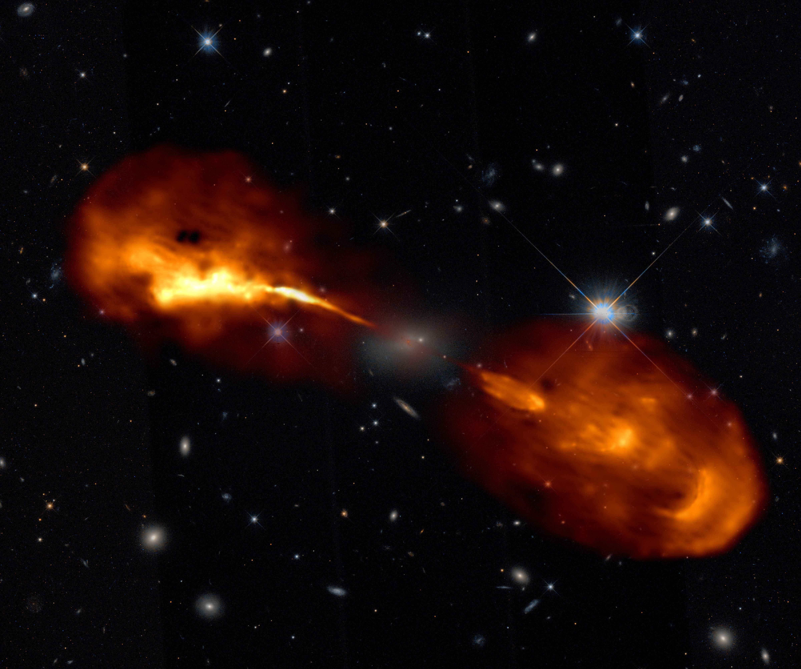
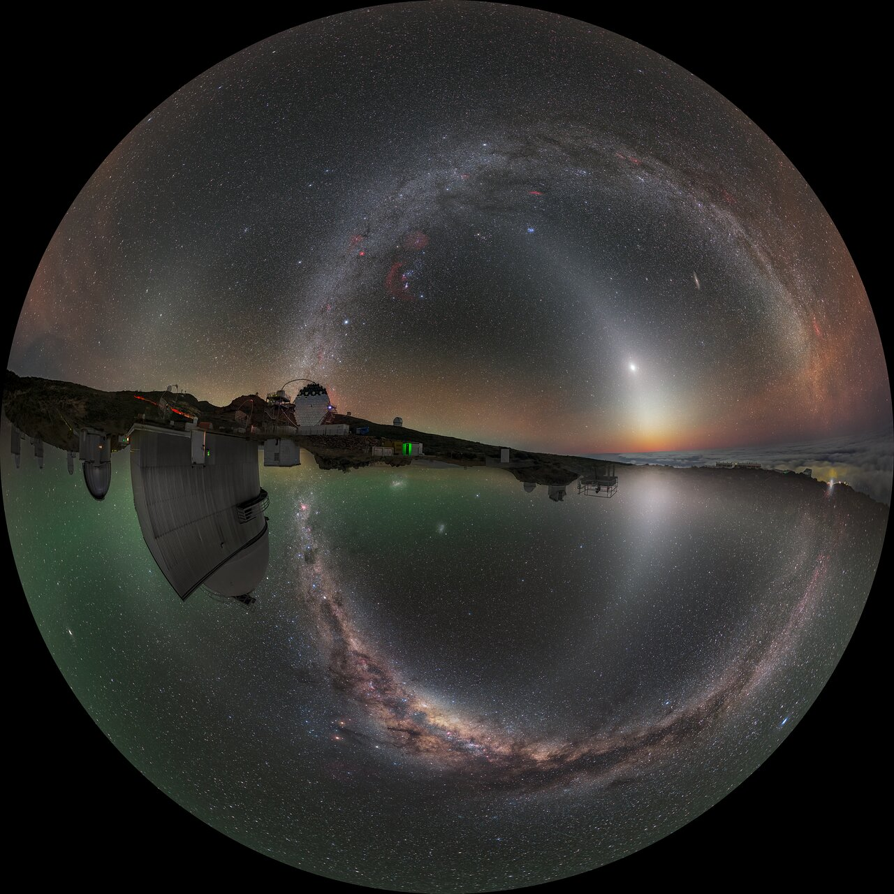

# WWT Newsletter: September 2021

Hello WWT community!

With the approach of cooler temps (at least in the northern hemisphere), we have
some cool and exciting updates for you this month to the [AAS WorldWide
Telescope](https://worldwidetelescope.org/home/) software universe! As usual, if
you've got any of your own news to share, let the team know on social media or
by emailing <wwt@aas.org>.

In this update:

- [Tiled FITS data in WWT+JupyterLab](#tiled-fits-data-in-wwtjupyterlab)
- [LOFAR Imagery in WWT](#lofar-reveals-radio-galaxies-in-unprecedented-detail)
- [Abstract submissions invited for WWT at AAS239! (Deadline October 12th)](#abstract-submissions-invited-for-wwt-at-aas239-deadline-october-12th)
- [NASA Deep Star Map 2020](#nasa-deep-star-map-2020)
- [ESO's North Meets South](#esos-north-meets-south)

Best,
Peter K. G. Williams, Director of the AAS WorldWide Telescope Project

---

## Tiled FITS data in WWT+JupyterLab

Some *BIG* news — with WWT you can now explore arbitrarily large scientific FITS
datasets! Learn more in this [video](https://youtu.be/To9SRgk1hjM) and follow
along with the tutorial to interactively explore 55 GB of FITS data from the
[Panchromatic Hubble Andromeda Treasury
(PHAT)](https://archive.stsci.edu/prepds/phat/). This is the culmination of many
hours of hard work from the development team, funded through an NSF grant
([#2004840](https://www.nsf.gov/awardsearch/showAward?AWD_ID=2004840)). Our
excitement for this new functionality is overflowing, so [give it a
try](https://bit.ly/pywwt-notebooks) and tell us what you think!

## LOFAR reveals radio galaxies in unprecedented detail

How about those jets from Hercules A (pictured below)? LOFAR's international
collaborators have published [11 research
papers](https://www.astron.nl/wp-content/uploads/2021/08/papers1782021.pdf) on
new imagery and scientific results. Several of the images are now
[viewable](https://bit.ly/wwt-lofar_17821) in context within WWT after a fair
bit of manual processing from David Weigel. Radio galaxies generally don't have
the same flair as something you might see from the Hubble Space Telescope, but
it is pretty neat to explore these ancient galaxies in WWT to get a sense of
their scale and distance.

## Abstract submissions invited for WWT at AAS239! (Deadline October 12th)

Are you the kind of person who might attend the
[AAS239](https://aas.org/meetings/aas239) conference in Salt Lake City in
January 2022? If so, you — yes, *you* — are invited to submit an abstract to
present at a special session on all things WWT! [See this page on the WWT
Contributor Hub for more
information](https://worldwidetelescope.github.io/events/2022/aas239-session.html#your-contributions-are-wanted).
Submissions don't count against the usual limit of one abstract per person per
meeting! Deadline October 12th.

## NASA Deep Star Map 2020

Last year NASA Scientific Visualization Studio (SVS) created a highly detailed
all sky map from various source data such as Gaia, Tycho, and Hipparchos. The
[Deep Star Map](https://bit.ly/wwt-dsm2020) is now explorable in WWT and is
accessible through the quick access imagery menu in the bottom left of [the
webclient](https://worldwidetelescope.org/webclient/) next to the "Look At" view
mode selection. Processing this data motivated the WWT dev team to add support
in the [toasty](https://toasty.readthedocs.io/) python package for the
[OpenEXR](https://www.openexr.com/) image format, which enables
high-dynamic-range (HDR) imagery at manageable files sizes.

## ESO's North Meets South

A rather unique take on an all sky survey where [northern skies meet those in
the south](http://bit.ly/wwt-eso_ns). We thought the concept was novel and
intriguing, and then were mesmerized by panning and zooming around — check it
out for yourself!

## Stay in Touch!

We always love to hear from WWT users and enthusiasts. [Follow our social media
accounts](https://worldwidetelescope.org/connect/), email <wwt@aas.org>, or post
on [the WWT forum](https://wwt-forum.org/).
