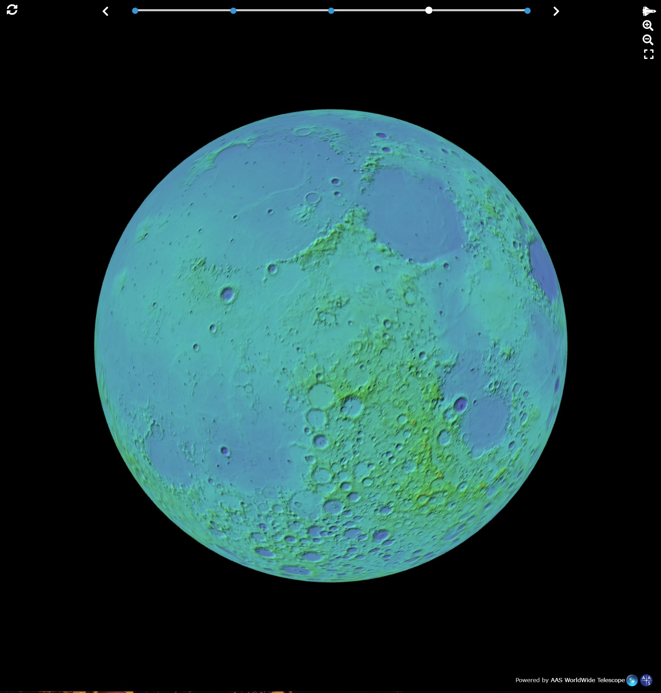

# WWT Newsletter: October 2021

Hello WWT community!

October has been quite the busy month — here are our latest updates about [AAS
WorldWide Telescope](https://worldwidetelescope.org/home/)! As usual, if you've
got any of your own news to share, let the team know on social media or by
emailing <wwt@aas.org>.

In this update:

- [International Observe the Moon Night](#international-observe-the-moon-night)
- [New Toasty upgrades for extra large imagery ingest](#new-toasty-upgrades-for-extra-large-imagery-ingest)
- [EXTENSION! Abstract submissions invited for WWT at AAS239! (new deadline today!)](#extension-abstract-submissions-invited-for-wwt-at-aas239-new-deadline-today)
- [WWT 2022 Edition](#wwt-2022-edition)
- [New Members of the WWT Steering Committee](#new-members-of-the-wwt-steering-committee)

Best,
Peter K. G. Williams, Director of the AAS WorldWide Telescope Project

---

## International Observe the Moon Night

[International Observe the Moon
Night](https://moon.nasa.gov/observe-the-moon-night/), an event that challenges
individuals to set aside a moment to intentionally look up at our closest
celestial neighbor, was October 16th this year. To celebrate, WWT developer Jon
Carifio and astrovizicist David Weigel created a [lunar
interactive](https://bit.ly/wwt-moonnight21) that you can use to explore
features on the moon's surface in greater detail than you'd get with the naked
eye — or even a powerful telescope! Change between different datasets and
pan/zoom to get a closer look. Pick your favorite two, find a location of
interest and use the circling arrows (top left corner) to swap between the two
layers. Datasets include:

- "Moon" — WWT lunar default: Lunar Reconnaissance Orbiter Wide Angle Camera Global Mosaic
- [CGI Moon Kit](https://svs.gsfc.nasa.gov/cgi-bin/details.cgi?aid=4720) -
  created by the [NASA Science Visualization Studio](https://svs.gsfc.nasa.gov/)
  (SVS) at Goddard Space Flight Center
- [SELENE Kaguya TC Ortho Global
  Mosaic](https://astrogeology.usgs.gov/maps/moon-kaguya-tc-global-mosaic) -
  high-resolution (7.4 meters per pixel!) imagery from JAXA
- [Moon LRO LOLA Color Shaded Relief 388m
  v4](https://astrogeology.usgs.gov/search/map/Moon/LMMP/LOLA-derived/Lunar_LRO_LOLA_ClrShade_Global_128ppd_v04) — a colorized elevation map
- [Unified Geologic Map of the
  Moon](https://astrogeology.usgs.gov/search/map/Moon/Geology/Unified_Geologic_Map_of_the_Moon_GIS_v2)

The interactive was used in promotion for a lunar tour
[premiered](https://youtu.be/b9sUBbJPUOg) by our friends at the U.S. Space &
Rocket Center.

Our thanks to the mission teams, NASA SVS, and USGS for making these great
datasets publicly available! We hope that WWT's technology helps you appreciate
them in a whole new way.

## New Toasty upgrades for extra large imagery ingest

In order to visualize the SELENE Kaguya lunar imagery, we needed to [write new
code](https://github.com/WorldWideTelescope/toasty/pull/63) in order to handle
enormous images in the JPG2000 file format. At 1,474,593 by 737,297 pixels,
which provides a beautifully crisp ~7.4 m/px resolution globally, the
160-gigabyte image needs to be broken into more manageable pieces during
processing, which the latest version of
[toasty](https://github.com/WorldWideTelescope/toasty) can now do. Even with the
toasty improvements, the code still took around 24 hours to fully process the
data on Harvard's
[Cannon](https://www.rc.fas.harvard.edu/about/cluster-architecture/) compute
cluster! You can explore the fruit of our efforts in [the lunar
interactive](https://bit.ly/wwt-moonnight21).

## EXTENSION! Abstract submissions invited for WWT at AAS239! (New deadline today)

If you are the kind of person who might attend the
[AAS239](https://aas.org/meetings/aas239) conference in Salt Lake City in
January 2022, you — yes, *you* — are invited to submit an abstract to present at
a special session on all things WWT! [See this page on the WWT Contributor Hub
for more
information](https://worldwidetelescope.github.io/events/2022/aas239-session.html#your-contributions-are-wanted).
Submissions don't count against the usual limit of one abstract per person per
meeting! Deadline **today** — October 29th. If you've already submitted an
abstract for this, we can't wait to see it, and you, in Salt Lake City.

## WWT 2022 Edition

Each newsletter mentions new this-and-that and it can be confusing (even for us)
to keep track of the status of the whole WWT ecosystem of software. Thus, we'd
like to tease the release of *WWT 2022 Edition*: the latest milestone of the WWT
team's efforts to develop a suite of astronomy visualization tools that run on
devices ranging from your phone to high-end planetariums. Launching to a
universe near you at AAS239!

## New Members of the WWT Steering Committee

The WWT project welcomes two new members to its [steering
committee](https://worldwidetelescope.org/about/governance/):

- [Dr. Robert Nikutta](https://datalab.noirlab.edu/people.php) of [NSF's
  NOIRLab](https://noirlab.edu/), project scientist for [Astro Data
  Lab](https://datalab.noirlab.edu/)
- [Dr. Catherine Zucker](https://catherinezucker.github.io/), a Hubble Fellow at
  the [Space Telescope Science Institute](https://www.stsci.edu/)

The project also thanks [Andy
Connolly](https://depts.washington.edu/astron/profile/connolly-andy/) for his
service as he rotates off of the committee.

## Stay in Touch!

We always love to hear from WWT users and enthusiasts. [Follow our social media
accounts](https://worldwidetelescope.org/connect/), email <wwt@aas.org>, or post
on [the WWT forum](https://wwt-forum.org/).
