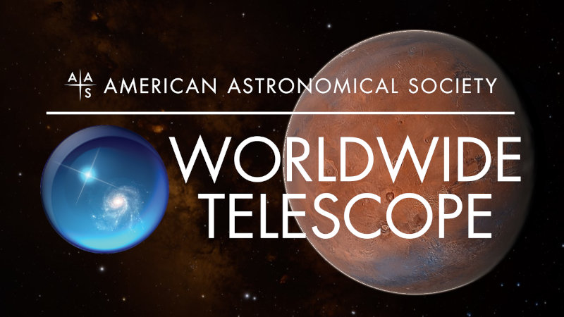

# WWT Newsletter: November 2021

## Support AAS WorldWide Telescope this Giving Tuesday

Hello WWT community,

I'll keep this short: *AAS WorldWide Telescope needs your support!*

As part of the non-profit [American Astronomical Society](https://aas.org/),
WWT's mission is to help scientists and educators showcase astronomical data and
knowledge. WWT's web servers send out gigabytes of data every hour to hundreds
of thousands of visitors every year. Your contributions help keep the WWT
servers running, delivering beautiful astronomical imagery to users around the
world for free, and demonstrate the breadth of the community that values WWT.
This [#GivingTuesday](https://www.givingtuesday.org/), please consider donating
to WWT and spreading the word!

#### [Donate to WWT now!](https://bit.ly/wwtdonate21)

Thank you,
Peter K. G. Williams, Director of the AAS WorldWide Telescope Project

