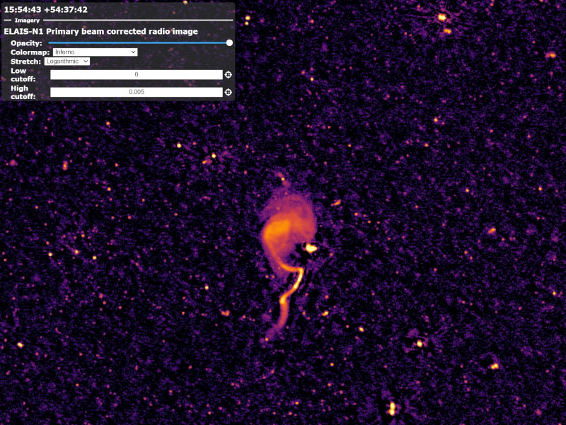

# WWT Newsletter: December 2021

Happy holidays, WWT community!

As we approach the end of 2021, we'd like to recap an exciting and busy year.
Software developments by the dozens and troves of new data will culminate in a
new release of [AAS WorldWide Telescope](https://worldwidetelescope.org/home/)
software suite in the New Year! As usual, if you've got any of your own news to
share, let the team know on social media or by emailing <wwt@aas.org> — and
please consider [supporting the WWT mission](https://bit.ly/wwtdonate21) this
holiday season.

In this update:

- [WWT 2022 Edition — Launching January](#wwt-2022-edition--launching-january)
- ["toasty view" — new Toasty update](#toasty-view--new-toasty-update)
- [New HiPS Datasets](#new-hips-datasets-in-wwt)
- [2021: Year in Review](#2021--year-in-review)

Best,
Peter K. G. Williams, Director of the AAS WorldWide Telescope Project

---

## WWT 2022 Edition — Launching January

As we mentioned in October, we often promote the new this-and-that features and
it can be confusing (even for us) to keep track of the status of the whole WWT
ecosystem of software. We are excited to announce the release of *WWT 2022
Edition*: the latest milestone of the WWT team's efforts to provide a suite of
astronomy visualization tools that run on devices ranging from your phone to
high-end planetariums.

**Late breaking**: we had planned to launch WWT2022 at the AAS239 winter meeting
in Salt Lake City, but with [the recent cancellation of the meetings' in-person
component](https://aas.org/posts/news/2021/12/aas-239-person-meeting-canceled),
we'll have to re-evaluate the schedule to see what makes sense. Watch this
space!


## "toasty view" — new Toasty update

The latest update to our [toasty](https://toasty.readthedocs.io/en/latest/) data
processing tool ([version
0.14](https://github.com/WorldWideTelescope/toasty/releases/tag/toasty%400.14.0))
introduces toasty view, a new command for viewing FITS files from the command
line — it will tile one or more datasets and open them in the WWT research app
all in one magical tool. Just run:

```
toasty view myfile.fits
```

and Toasty will do the rest! Here's a screenshot where we've opened a
[750-megabyte FITS
file](https://www.lofar-surveys.org/deepfields_public_en1.html) and zoomed in on
a spectacular radio galaxy in the [ELAIS-N1 Deep
Field](https://bit.ly/wwt-lofar_elais-n1) from the International Low Frequency
Array (LOFAR).




## New HiPS Datasets in WWT

New HiPS datasets have been added to the WWT collection — all of these will now
available in the research app and webclient!

- Gaia EDR3
- SkyMapper Southern Sky Survey DR1.1
- Band-merged UnWISE catalog and imagery
- VISTA Hemispheric Survey catalog DR5
- TESS Input Catalog v8.0
- ACT2 DR4 CMB map
- New planetary/moon maps: Ariel, Callisto, Charon, Dione, Europa,  Ganymede,
  Iapetus, Io, Jupiter, lots of Mars, Mercury, Mimas, ....
- Hyper-Suprime Cam DR2 deep and wide surveys
- TESS 2-year mosaic
- THOR radio continuum survey
- RACS (Rapid ASKAP Continuum Survey) epoch 1
- APERTIF DR1 uncalibrated continuum
- LOFAR LoTSS DR1
- XMM-Newton PN band 4 (2-4.5 keV) mosaic

As an example, [here's a demo allowing you to explore Ethan Kruse's TESS mosaic
with the TESS Input Catalog
overlaid.](https://web.wwtassets.org/research/latest/?script=eyJldmVudCI6ImNlbnRlcl9vbl9jb29yZGluYXRlcyIsInJhIjoxNzkuNDIzNzQ1MjQwNzM1MTIsImRlYyI6LTY1LjMzOTc1NzI1NTg3MTEzLCJmb3YiOjU5Ljk5OTk5OTk5OTk5OTk5LCJyb2xsIjowLCJpbnN0YW50Ijp0cnVlfQ%3D%3D%2CeyJldmVudCI6InNldF9iYWNrZ3JvdW5kX2J5X25hbWUiLCJuYW1lIjoiVEVTUyAyeXIifQ%3D%3D%2CeyJldmVudCI6ImxheWVyX2hpcHNjYXRfbG9hZCIsInRocmVhZElkIjoiZjRhM2M1ZDctYTJjMi00MGRiLWI0ZDYtNzk0NjU1N2I3MjEwIiwidGFibGVJZCI6IlRFU1MgSW5wdXQgQ2F0YWxvZyAtIHY4LjAgKFRJQy04KSAoU3Rhc3N1bissIDIwMTkpICh0aWMpIiwibmFtZSI6IlRFU1MgSW5wdXQgQ2F0YWxvZyAtIHY4LjAgKFRJQy04KSAoU3Rhc3N1bissIDIwMTkpICh0aWMpIn0%3D%2CeyJldmVudCI6InRhYmxlX2xheWVyX3NldF9tdWx0aSIsImlkIjoiVEVTUyBJbnB1dCBDYXRhbG9nIC0gdjguMCAoVElDLTgpIChTdGFzc3VuKywgMjAxOSkgKHRpYykiLCJzZXR0aW5ncyI6WyJhc3Ryb25vbWljYWwiLCJjb2xvciIsImVuYWJsZWQiLCJmYWRlU3BhbiIsIm5hbWUiLCJvcGFjaXR5Iiwib3BlbmVkIiwicmVmZXJlbmNlRnJhbWUiLCJ2ZXJzaW9uIiwiYWx0Q29sdW1uIiwiYWx0VHlwZSIsImFsdFVuaXQiLCJiYXJDaGFydEJpdG1hc2siLCJiZWdpblJhbmdlIiwiY2FydGVzaWFuQ3VzdG9tU2NhbGUiLCJjYXJ0ZXNpYW5TY2FsZSIsImNvbG9yTWFwQ29sdW1uIiwiY29sb3JNYXBwZXJOYW1lIiwiY29vcmRpbmF0ZXNUeXBlIiwiZGVjYXkiLCJkeW5hbWljQ29sb3IiLCJkeW5hbWljRGF0YSIsImVuZERhdGVDb2x1bW4iLCJlbmRSYW5nZSIsImdlb21ldHJ5Q29sdW1uIiwiaHlwZXJsaW5rQ29sdW1uIiwiaHlwZXJsaW5rRm9ybWF0IiwibGF0Q29sdW1uIiwibG5nQ29sdW1uIiwibWFya2VyQ29sdW1uIiwibWFya2VySW5kZXgiLCJtYXJrZXJTY2FsZSIsIm5hbWVDb2x1bW4iLCJub3JtYWxpemVDb2xvck1hcCIsIm5vcm1hbGl6ZUNvbG9yTWFwTWF4Iiwibm9ybWFsaXplQ29sb3JNYXBNaW4iLCJub3JtYWxpemVTaXplIiwibm9ybWFsaXplU2l6ZUNsaXAiLCJub3JtYWxpemVTaXplTWF4Iiwibm9ybWFsaXplU2l6ZU1pbiIsInBsb3RUeXBlIiwicG9pbnRTY2FsZVR5cGUiLCJyYVVuaXRzIiwic2NhbGVGYWN0b3IiLCJzaG93RmFyU2lkZSIsInNpemVDb2x1bW4iLCJzdGFydERhdGVDb2x1bW4iLCJ0aW1lU2VyaWVzIiwieEF4aXNDb2x1bW4iLCJ4QXhpc1JldmVyc2UiLCJ5QXhpc0NvbHVtbiIsInlBeGlzUmV2ZXJzZSIsInpBeGlzQ29sdW1uIiwiekF4aXNSZXZlcnNlIl0sInZhbHVlcyI6W3RydWUsIiNGRjAwQzgiLHRydWUsMCwiVEVTUyBJbnB1dCBDYXRhbG9nIC0gdjguMCAoVElDLTgpIChTdGFzc3VuKywgMjAxOSkgKHRpYykiLDEsZmFsc2UsIlNreSIsMiwtMSwic2VhTGV2ZWwiLCJtZXRlcnMiLDAsIjIxMDAtMDEtMDFUMDU6MDA6MDAuMDAwWiIsMSwibWV0ZXJzIiwtMSwiR3JleXMiLCJzcGhlcmljYWwiLDE2LGZhbHNlLGZhbHNlLC0xLCIxODAwLTAxLTAxVDA0OjU2OjAyLjAwMFoiLC0xLC0xLCIiLDIsMSwtMSwwLCJ3b3JsZCIsMCxmYWxzZSwxLDAsZmFsc2UsZmFsc2UsMSwwLCJjaXJjbGUiLDQsImRlZ3JlZXMiLDEsZmFsc2UsMjIsMjYsZmFsc2UsLTEsZmFsc2UsLTEsZmFsc2UsLTEsZmFsc2VdfQ%3D%3D)

As always, the WWT team thanks the many researchers worldwide who go to the
extra effort to not only create these datasets, but to share them in a way that
allows them to be visualized in freely-available software like WWT!


## 2021 — Year in Review

What a year 2021 has been for WWT! Some highlights:

- Jon Carifio was hired as a software developer and has gotten off to a
  fantastic start, contributing all over the project.
- WWT can now view arbitrarily large scientific FITS datasets, thanks to work
  funded by the National Science Foundation (grant
  [#2004840](https://www.nsf.gov/awardsearch/showAward?AWD_ID=2004840)).
- We designed and built the new WWT "research app", delivering [a unique
  cloud-based tool for astronomy researchers](https://bit.ly/pywwt-notebooks).
- The toasty data-preparation software gained a boatload of features, including
  pipeline functionality allowing for bulk image importation, tiling, and
  alignment from observatories or organizations such as NOIRLab, ESO, and the
  soon to launch James Webb Space Telescope.
- We celebrated International Observe the Moon Night by creating a [lunar
  interactive](https://bit.ly/wwt-moonnight21).
- The [new WWT Aligner
  tool](https://docs.worldwidetelescope.org/aligner/latest/), whose creation was
  supported by the [Space Telescope Science Institute](https://stsci.edu/),
  helps image creators add sky-coordinate information to their images, making
  them viewable not just in WWT but in all other kinds of sky-based software as
  well.

And that's not even mentioning the data! To keep this newsletter a reasonable
length, here's an inexhaustive list (with links) of the data imported by the WWT
team this year. In no particular order (just kidding, our favorites are at the
top):

- [NOIRLab Collection](https://bit.ly/wwt-noirlab_aug21) (400+ images)
- [Panchromatic Hubble Andromeda Treasury](https://bit.ly/wwt-phat21) (PHAT) FITS Data (55+ GB)
- [International Observe the Moon Night Embed](https://bit.ly/wwt-moonnight21)
  - "Moon" — WWT lunar default: Lunar Reconnaissance Orbiter Wide Angle Camera Global Mosaic
  - [CGI Moon Kit](https://svs.gsfc.nasa.gov/cgi-bin/details.cgi?aid=4720) -
    created by the [NASA Science Visualization Studio](https://svs.gsfc.nasa.gov/)
    (SVS) at Goddard Space Flight Center
  - [SELENE Kaguya TC Ortho Global
    Mosaic](https://astrogeology.usgs.gov/maps/moon-kaguya-tc-global-mosaic) -
    high-resolution (7.4 meters per pixel!) imagery from JAXA
  - [Moon LRO LOLA Color Shaded Relief 388m
    v4](https://astrogeology.usgs.gov/search/map/Moon/LMMP/LOLA-derived/Lunar_LRO_LOLA_ClrShade_Global_128ppd_v04) — a colorized elevation map
  - [Unified Geologic Map of the
    Moon](https://astrogeology.usgs.gov/search/map/Moon/Geology/Unified_Geologic_Map_of_the_Moon_GIS_v2)
- Perseverance Rover [Van Zyl Overlook](https://bit.ly/wwt-vanzyl) Mars Panorama (a 93k × 46.5k image!)
- [LOFAR July 17 Collection](https://bit.ly/wwt-lofar_17821)
- [Robbins Lunar Crater Database](https://bit.ly/wwt-lunarcraters21) (1.3 million craters circled — this takes time to load and requires a discrete GPU to play nicely!)
- Curiosity Rover [Navarro Mountain](https://bit.ly/wwt-navarro_mt) Mars Panorama
- [SOFIA Collection](https://bit.ly/wwt-sofia_mar21)
- [3D Gaia EDR3 Dataset](https://bit.ly/wwt-3Dgaia21) (this also takes time to load and requires a discrete GPU to play nicely)
- [LOFAR ELAIS-N1](https://bit.ly/wwt-lofar_elais-n1) Deep Field Survey
- [Apollo 15 Stop 9A](https://bit.ly/wwt-a15_s9a) Panorama
- [Apollo 17 Station 5](https://bit.ly/wwt-a17_s5) Panorama
- [Perseverance and Curiosity Rovers Mars Panoramas](https://bit.ly/wwt-marspanos_may21)
- [THEMIS IR Day (Mars) Global Mosaic](https://bit.ly/wwt-themisweb)
- Bennu (Asteroid) Global Mosaic
- [Deep Star Maps 2020](https://bit.ly/wwt-dsm2020) (NASA SVS)
- ESO [North Meets South](https://bit.ly/wwt-eso_ns) Panorama

Phew! Looks like we've got our work cut out for us in 2022, but with an entire
software suite release and plenty of projects and ideas in the pipeline we are
gearing up for another great year, so ...


## Stay in Touch!

We always love to hear from WWT users and enthusiasts. [Follow our social media
accounts](https://worldwidetelescope.org/connect/), email <wwt@aas.org>, or post
on [the WWT forum](https://wwt-forum.org/). And if you want to show your support
for WWT, please consider [a donation to help keep the WWT servers running
24/7](https://bit.ly/wwtdonate21)!