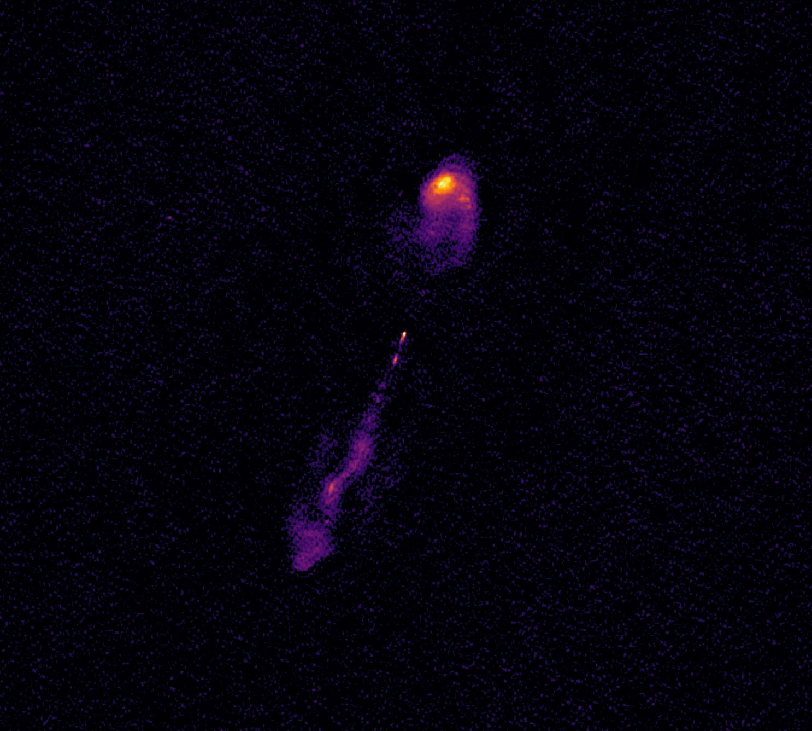
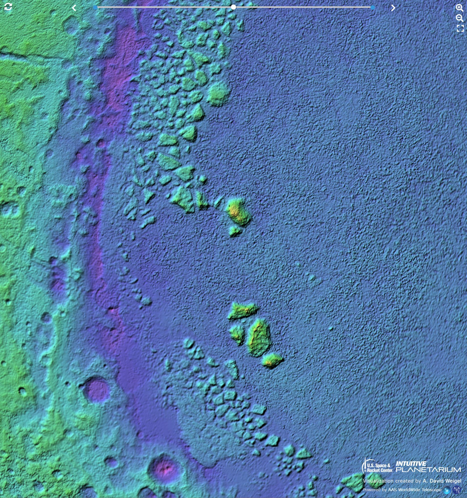
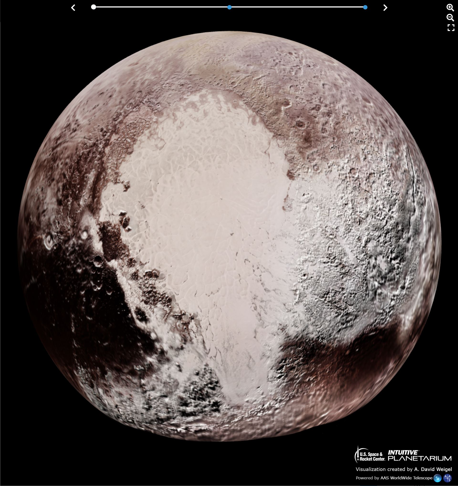

# WWT Newsletter: April 2022

Happy spring, WWT community!

We are so excited to reiterate that [WWT 2022][home] is released! The WWT team
took a moment to breathe after its release, but we've been back hard at work
continuing development and ingesting more data. As usual, if you've got any of
your own news to share, let the team know on social media or by emailing
<wwt@aas.org> — and please consider [supporting the WWT mission][support].

[home]: https://worldwidetelescope.org/home/
[support]: https://bit.ly/wwtdonate22

In this update:

- [WWT 2022 Edition — New Windows client release](#wwt-2022-edition--new-windows-client-release)
- [Explore the LOFAR Lockman Hole Deep Field](#explore-the-lofar-lockman-hole-deep-field)
- [JWST Alignment Image](#jwst-alignment-image-in-wwt)
- [Pluto Interactive](#pluto-interactive)

Best,

Peter K. G. Williams, Director of the AAS WorldWide Telescope Project

---

### WWT 2022 Edition — New Windows client release

The WWT team is pleased to announce [a new release of the WWT Windows client][windl],
version 6.1.1.0. This is a bugfix release, correcting a few issues that have been reported:

[windl]: https://worldwidetelescope.org/download/#windows-client

- The Windows client can now correctly load tours containings HiPS progressive
  catalog datasets that were created by the web client, and in turn creates
  tours that the web client can load.
- Three-dimensional models loaded from the `.OBJ` file format will no longer be
  mirror-imaged.

For a few additional details, please see [the technical changelog][cl].

[cl]: https://github.com/WorldWideTelescope/wwt-windows-client/blob/release/WWTExplorer3d/CHANGELOG.md

This release also includes a few data updates. These updates should
automatically become available to all Windows users, not just the ones that
install the latest version of the software:

- WWT’s planetary data holdings have expanded to include [six new global maps of
  Mercury][merc].
- We’ve removed a smattering of images with broken sky positioning that lack a
  clear path to fixing up their coordinates, or that are redundant with correct
  images.
- Under the hood, the datasets now all include correct constellation metadata.

[merc]: https://worldwidetelescope.org/webclient/?wtml=https://data1.wwtassets.org/packages/2022/01_wwt_2022_edition_data/Planetary%20Collections/mercury_v3.wtml


### Explore the LOFAR Lockman Hole Deep Field

One of the powerful new features of the WWT 2022 [toasty] data processing tool
(currently version [0.16.1][tcl]) is [`toasty view`], a new command for viewing
FITS files from the command line — it will tile one or more datasets and open
them in the WWT research app all in one magical tool. Just run:

[toasty]: https://toasty.readthedocs.io/
[tcl]: https://github.com/WorldWideTelescope/toasty/blob/release/CHANGELOG.md
[`toasty view`]: https://toasty.readthedocs.io/en/latest/cli/view.html

```
toasty view myfile.fits
```

and Toasty will do the rest! Our latest example use case is the [~31-gigabyte
FITS file][hdfields] from the International Low Frequency Array (LOFAR) called
the Lockman Hole Deep Field: [check it out!][lhviewer] This interactive starts
zoomed very far in on a radio galaxy, one of 2483 sources detected in the 6.6
square-degree region, so be sure to zoom out and explore around. You can read
[the recent preprint by Sweijen et al. (2022)][s22] that describes the data
release.

[hdfields]: https://www.lofar-surveys.org/hdfields.html
[lhviewer]: https://bit.ly/wwt-lofar_lh_dr1
[s22]: https://arxiv.org/abs/2202.01608

[][lhviewer]


### JWST Alignment Image in WWT

The optics of the incredible new [James Webb Space Telescope][jwst] are aligned,
as proved to the world by the release of a now-iconic image of the star [2MASS
J17554042+6551277][2m17+65] which [you can now view in WWT][taei]! Zoom in and
explore the background galaxies in the image, a teaser for the upcoming science
that JWST will provide in the near future.

[jwst]: https://jwst.nasa.gov/
[2m17+65]: http://simbad.u-strasbg.fr/simbad/sim-id?protocol=html&Ident=2MASSJ17554042%2B6551277&NbIdent=1&Radius=2&Radius.unit=arcmin
[taei]: https://bit.ly/wwt-jwst-taei_mar22


### Pluto Interactive

Is Pluto a planet? Does the argument even matter when we’re privileged to
experience views like the ones below?! You can explore a variety of Pluto maps
in a [new interactive][plutoint] created by David Weigel of the U.S. Space &
Rocket Center. This screenshot shows how you can explore Pluto’s topography
using a colorized terrain map:

[plutoint]: https://bit.ly/wwt-pluto_mar22

[][plutoint]

And this one shows an enhanced color view of Tombaugh Regio, the heart of Pluto.

[][plutoint]

This interactive is also a great example of how WWT makes it easy to create your
own custom visualizations: the WWT engine software handles all of the heavy
lifting, and with modern web tools you don’t need to be an expert developer to
create a slick user interface on top!


## Stay in Touch!

We always love to hear from WWT users and enthusiasts. [Follow our social media
accounts](https://worldwidetelescope.org/connect/), email <wwt@aas.org>, or post
on [the WWT forum](https://wwt-forum.org/). And if you want to show your support
for WWT, please consider [a donation to help keep the WWT servers running
24/7](https://bit.ly/wwtdonate22)!
