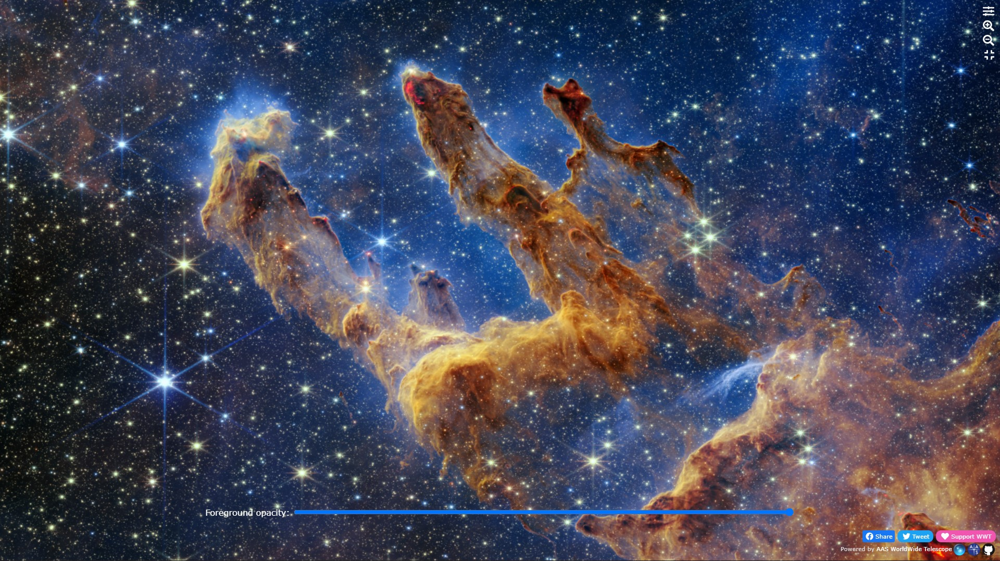
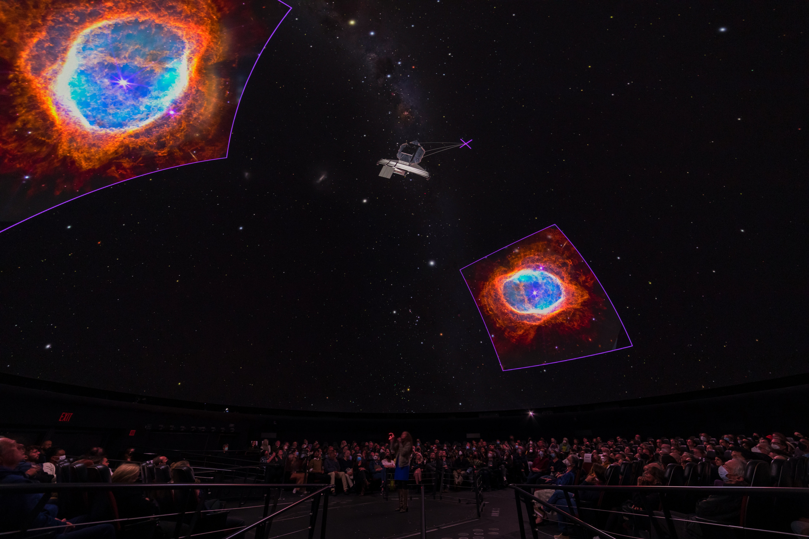
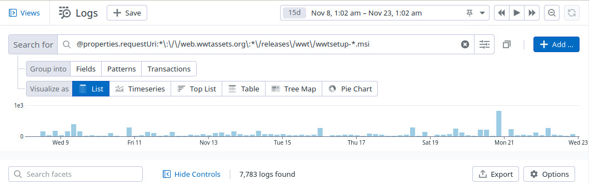

# WWT Newsletter: November 2022

For those of you who are celebrating, happy Thanksgiving!

## JWST keeps the hits coming

After the blockbuster [initial release of JWST data][jwst-release], the hits
from this new observatory keep on coming, and the WWT team has been importing as
many as they can! Since the initial release we’ve added [JWST’s view of the
Pillars of Creation][jwst-pillars], and [map of hugely distant galaxies from the
CEERS collaboration][jwst-ceers], the [Cartwheel Galaxy][jwst-cartwheel], and
more. The “JWST” category in the [WWT web client][webclient] will always have an
up-to-date collection of images as they’re imported into WWT.

[jwst-release]: https://web.wwtassets.org/specials/2022/jwst-release/
[jwst-pillars]: https://web.wwtassets.org/specials/2022/jwst-pillars/
[jwst-ceers]: https://web.wwtassets.org/specials/2022/jwst-ceers/
[jwst-cartwheel]: https://web.wwtassets.org/specials/2022/jwst-cartwheel/
[webclient]: https://worldwidetelescope.org/webclient/

[][jwst-pillars]

## WWT and OpenSpace together in the dome

Over the past year, the teams behind WWT and the similar [OpenSpace] planetarium
software have been collaborating to combine the best parts of these two powerful
programs. Starting with its version 0.18.0, OpenSpace can now *embed* WWT inside
its view, allowing you to explore high-resolution imagery in the context of
OpenSpace’s sophisticated 3D environment. How does that look? Awesome!!! Thanks
to researcher and power user Jackie Faherty, here’s a photo of the combination
running live inside the [Hayden Planetarium][hayden] at the American Museum of
Natural History in New York.

[OpenSpace]: https://www.openspaceproject.com/
[hayden]: https://www.amnh.org/research/hayden-planetarium

This embedding feature is built on the programmability of the [WWT web
engine][web-engine], and is a great demonstration of its power and flexibility.

[web-engine]: https://docs.worldwidetelescope.org/webgl-reference/latest/

## Better analytics and monitoring thanks to Datadog

Thanks to generous support from the Open Source program at [Datadog], the WWT
team now has much better — well, *any* — insight into what’s happening on the
WWT web servers. For instance, how many times was the WWT Windows client
downloaded in the past 15 days?

[Datadog]: https://datadoghq.com/

Seven thousand, seven hundred and eighty-three times! Until recently, the team
had no ability to answer these kinds of questions: WWT’s [Azure] web services
produce such a torrent of logs that it was really difficult to analyze them in
any useful way. (The WWT web servers handle more than 2.5 million requests per
day!) This was a real problem, because it meant that we couldn't measure a lot
of basic things about how much, and in what ways, WWT is being used.

[Azure]: https://azure.microsoft.com/

Although the WWT team is still only using a small fraction of Datadog’s
capabilities, a lot of valuable insight has already been gained. For instance,
we were able to measure that our [JWST explorer apps][jwst-release] were used
more than half a million times in just a few days! Along with these kinds of
analytics, Datadog will help us monitor the WWT servers and make sure they're
running smoothly. To that effect we’ve also created [a public
dashboard][dashboard] that displays realtime information about what’s going on
with the WWT web services. We're looking forward to getting lots more use out of
this tool as we become more sophisticated users of it.

[dashboard]: https://p.us3.datadoghq.com/sb/cf4ddee0-e5ae-11ec-90f8-da7ad0900003-c64423f0e5e0627e2eb777abe3e591b0

Best,

Peter K. G. Williams, Director of the AAS WorldWide Telescope Project
